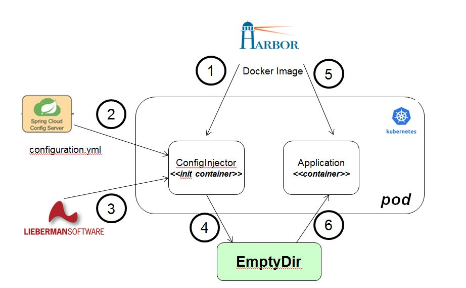

# Jenkins Pipeline Agent to inject Spring Boot application config on k8s configmap
Fetches Spring Boot application configurtation files (yaml, properties) from Spring Cloud Config server and injects config on HELM chart on a k8s configmap. This GO app get packaged on docker images and executed as Jenkins Docker Agent on Jenkins Groovy deployment pipeline
[Read about Spring Cloud Config server](https://o7planning.org/en/11727/understanding-spring-cloud-config-client-with-example)

## Injecting Spring

1. k8s pulls init container from Harbor Docker registry on POD deployment, this images runs the GO configuration injection program.
2. GO program pulls the application configuration yaml file from Spring Cloud Config server over HTTPS.
3. Searches for GO Template placeholders alike {{password}} format, depicting the Libermann password credential ID's. Call Liebermann over REST to obtaining the password and inject that password on the properties file.
4. GO program saves the property file on a directory that is mounted through kubernetes k8s volumemount, after having replaced all placeholders with passwords and credentials from Liebermann.
5. After successfully completing the init-container, the real application image gets pulled from Harbor Docker registry and started.
6. The application containers gets the EmptyDir device mounted on its /usr/include directory and will receive the application property file containing all secrets derived from Liebermann.



## Sharing storage between Go init container and application container.
```
    spec:
      containers:
      - name: demo
        image: agilesolutions/demo:latest
        imagePullPolicy: IfNotPresent
        ports:
        - containerPort: 8080
        resources:
          requests:
            cpu: "200m"
            memory: "300Mi"
        volumeMounts:
          - name: workdir
            mountPath: /usr/include
            readOnly: false
        env:
          - name: PORT
            value : "8080"
# These containers are run during pod initialization
      initContainers:
      - name: init-config
        image: agilesolutions/configinjector:remote
        command: ['configinjector', '-url=http://configserver:8888/foo/dev', '-directory=/usr/include']
        volumeMounts:
          - name: workdir
            mountPath: /usr/include
            readOnly: false
      volumes:
      - name: workdir
        emptyDir: {}
```

## setup

* [goto](https://www.katacoda.com/courses/docker/deploying-first-container)
* git clone https://github.com/agilesolutions/configinjector.git
* curl -LO https://dl.google.com/go/go1.13.linux-amd64.tar.gz
* tar -C /usr/local -xzf go1.13.linux-amd64.tar.gz
* export PATH=$PATH:/usr/local/go/bin	
* export GOPATH=/root/go
* export GOBIN=/usr/local/go/bin
* export PATH=$PATH:$(go env GOPATH)/bin
* go env GOPATH

## build linux image on windows

```
set GOARCH=amd64
set GOOS=linux

check with 

go env

go build -o configinjector configinjector.go
```
## build

```
go build -o  .

configinjector -url=https://localhost:8888/{application}/{profile}[/{label}] -directory=chart

example:

configinjector -url=http://localhost:8888/foo/dev -directory=chart

docker build -t agilesolutions/configinjectorr:latest .
```

## run
configinjector -url=https://localhost:8888/{application}/{profile}[/{label}] -directory=chart

In which {label} placeholder refers to a GIT branch, {application} to the client's application name and the {profile} to the client's current active application profile.

## now run this docker agent on a jenkins pipeline, lets spin up jenkins

* [go to katacoda](https://www.katacoda.com/courses/kubernetes/helm-package-manager)
* create directory /jenkins
* docker run -d --name jenkins --user root --privileged=true -p 8080:8080 -v /jenkins:/var/jenkins_home -v /var/run/docker.sock:/var/run/docker.sock jenkinsci/blueocean
* docker logs -f jenkins
* docker exec -ti jenkins bash
* docker ps -a
* browse to http://localhost:8080 and wait until the Unlock Jenkins page appears.
* get password from /jenkins/secrets/initialAdminPassword
* create new pipeline job from https://github.com/agilesolutions/bomverifier.git

## include on pipeline

```
pipeline {
  agent none
  environment {
    DOCKER_IMAGE = null
  }
  stages {
    stage('config') {
      agent {
          docker {
              image 'agilesolutions/configinjector:latest'
          }
      }
      steps {
        sh 'bomverifier -url=https://raw.githubusercontent.com/agilesolutions/bomverifier/master/bom.txt -terminate'
      }
    }
    stage("deploy") {
      when {
        branch "master"
      }
      steps {
        container("helm") {
			k8sUpgrade(params.artifact, params.version)
        }
      }
    }
```
Groovy k8sUpgrade pipeline step...

```
def call(artifact, version ) {
    sh 'helm upgrade \
        ${artifact} \
        charts/${artifact} -i \
        --namespace ${artifact} \
        --set image.tag=${version} \
        --set ingress.host=${artifact} \
        --reuse-values'
}
```

## read

1 [check this](https://www.callicoder.com/docker-golang-image-container-example/)
2 [parse yaml](https://stackoverflow.com/questions/28682439/go-parse-yaml-file/28683173)
3 [wget to file](https://stackoverflow.com/questions/11692860/how-can-i-efficiently-download-a-large-file-using-go)
4 [get go package](https://gopkg.in/yaml.v2)
5 [jenkins pipelines and docker agents](https://jenkins.io/doc/book/pipeline/docker/)
6 [regex placeholder replacement](https://github.com/shapeshed/golang-book-examples/blob/master/hour22/example06.go)
